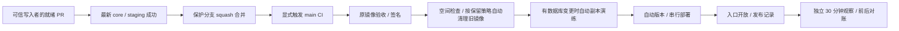

# 自动合并与发版

所有者于 2026-10-04 明确要求继续实施，并将今后发布改为全自动、无需其审核。这是持续授权，替代原先每次 PR 自审确认和部署批准要求；不需要机器人伪造人的审查记录。业务中的成员申诉、账号核验和破坏性数据库恢复不因此变成自动批准。

## 日常路径

`Automatic Integration` 只处理当前仓库、main 目标、规定分支前缀、非 Draft、作者具有 write/maintain/admin 权限的 PR。Draft 是尚未完成开发或验收的状态，由开发代理在完成后设为就绪，不要求所有者点击。来自 fork 或只读贡献者的 PR 不进入这个具有写权限的自动化入口。

控制器从可信 workflow commit 检出，不运行 PR 内容。合并使用精确 head SHA 与服务端保护规则；遇到分支落后时先更新分支，再验证新 SHA。机器人不绕过 core/staging、不添加虚构 approval、不强推 main。失败 CI 不自动反复重跑；应修复后再产生新提交。

GitHub 对 `GITHUB_TOKEN` 产生的事件有递归限制，不能假设机器人合并会自然触发 push CI。控制器显式 dispatch main CI；对 token 产生的待批准 PR CI，则 dispatch 精确 PR 分支，并验证 PR 编号、当前 SHA 和来源。每小时 17/47 分的轻量调度只弥补漏触发，不定时重建相同成功版本。main 的显式 CI 与 main push 适用同一签名和发布规则，PR dispatch 不能发布镜像。

main CI 在验签、候选 artifact 留存之后显式 dispatch `Deploy Production`，传入自身 SHA、run/attempt 和 `automatic=true`。这是唯一自动部署触发路径，移除并行的 workflow_run 监听以避免重复部署。实际机器人 CI `37187764652` 完成后未产生该监听事件，因此不能依赖它自然衔接。

发布端允许 CI 做最后清理，最多补读十次完成状态，再用已认证 API 验证 CI 必须 completed/success、精确 attempt、仓库、workflow 和 SHA；不能仅凭发布 job 自己成功就切换。只有 main publish 获得交接所需 actions:write，PR 不获得该权限。过时 main 候选会在计划阶段及取得部署并发锁后跳过。自动分配最大规范 SemVer 的下一个 patch；同 SHA 重试复用已有唯一 tag，标签竞争时核对目标，不重写标签。主机仍按签名 digest 拉取，执行已有预检、排空、备份、迁移和健康门禁。

## 浏览器验收的后台任务隔离

完整 E2E 保持候选 Web/Worker 运行，但在全局 setup 中暂停独立测试 Redis 的 `weekly-challenges` 队列，并最多等待 15 秒让已有任务结束；整个浏览器矩阵完成后恢复原暂停状态。视频队列、Worker 心跳及其他维护继续运行，生产代码和周日 18 点生成、周一补跑规则不变。仅允许显式 `PLAYWRIGHT_ISOLATED_SERVICES=1`、本机测试数据库（必须指定 schema）与独立本机 Redis；本地执行 E2E 也须配置这些测试服务。不得指向生产转发端口或共享 Redis。

实际 main CI `37193998034` 在周日 18 点后被此竞态拦住：后台重试把 E2E 的下周 FAILED 周期改为 READY 并改写 model，原清理条件遗漏该行，后续 fixture 创建相同 periodStart 触发唯一约束。真实 BullMQ/PostgreSQL 回归同时复现旧失败和验证暂停期间样例不变、恢复后任务正常执行；未删除唯一约束、关闭 Worker 或跳过浏览器验收。队列隔离只服务于人工构造的 UI 状态，生成和恢复业务仍由集成测试及 staging 生命周期验收覆盖。

## 发布后观察

签名验证后先运行[镜像保留与容量检查](PRODUCTION-IMAGE-RETENTION.md)。可用空间达到 6 GiB 就直接继续；不足时仅清理超过 14 天、远程 digest 已验证可恢复且未受保留规则保护的项目镜像。无法恢复足够空间时停止，不删除数据库卷或备份，不需要所有者逐次审核。

签名和 migration 校验通过后，自动检查候选 schema 与健康线上版本。完全相同则记录跳过重复副本演练；有任何差异时自动恢复现有校验备份，在隔离容器内脱敏、迁移两次、检查 schema 与汇总守恒。失败阻止分配版本和后续服务切换，成功证据写入 release artifact，具体边界见 [生产副本演练](PRODUCTION-COPY-REHEARSAL.md)。

部署 job 完成并记录 GitHub Release 后，观察 job 独立运行，不占用 production 部署并发组。每 30 秒在主机共享锁内检查本地/TLS 健康、App/Worker 精确版本、登录页 200；开始和结束各执行一次只读积分对账。对账原始行仅进入主机临时私有文件，结束即删除，artifact 只有状态和时间，不上传账户、备份、密钥或原始日志。

观察要求连续健康至少 30 分钟；短暂故障或维护锁会重置健康时窗，3 次连续失败即失败，总时长上限 65 分钟。另一个受主机锁保护的部署接替后，旧观察标记 superseded，不干预新版本、不宣称旧版完成观察。观察失败使 Actions 失败并保留证据，现有运维告警继续工作；不凭健康探针失败自动回退数据库。

GitHub Release 包含 commit、CI run/attempt、App/Worker digest、migration 数量、执行者、时间、原版本和证据链接。观察只更新属于同部署 ID 的记录，不覆盖同版本较新重发的结论。发布仍在观察中、观察失败或被接替都不算完整验收通过。RUM/API p95、队列与资源趋势另见性能观测面板，不能把合成探针当成真实用户性能数据。

## 平台设置与失败处理

无人值守路径可能以 `github-actions[bot]` 等 GitHub App 身份执行。发布请求和镜像保留工具接受规范的 `[bot]` 后缀并保留原始操作者名称进入审计；仍拒绝嵌入后缀、空白或命令字符，不冒用所有者身份。依据：[GitHub 机器人 actor 示例](https://docs.github.com/en/code-security/reference/supply-chain-security/dependabot-on-actions)及 [GITHUB_TOKEN 身份与触发规则](https://docs.github.com/en/actions/concepts/security/github_token)。

- main：PR 必需、批准数 0、core/staging 必需且绑定 GitHub Actions、strict、管理员同样受约束、只允许 squash、禁止强推和删除。
- production Environment：只允许精确 main，无 required reviewers，无人工等待计时器；保留现有密钥。
- workflow_dispatch 同时承接 CI 自动交接和有明确版本依据的故障恢复/归档重发；默认 automatic=false 保留恢复语义。没有日常人工确认项；重置管理员、放宽失败前置健康或延期告警仍是有技术含义的显式参数，不是审查按钮。
- 迁移开始前失败按旧容器和健康证据恢复；迁移后失败保留维护入口与证据，采用兼容的前向修复。自动化不能使不兼容的历史镜像安全回滚。
- 上次失败已完整恢复时，下一次发布自动核验而不要求人工确认：不可变历史 journal 与 active 记录一致，未开始 migration、配置已恢复、维护和旧队列恢复标记不存在，源码回到原 SHA，原 Web/Worker 同版且容器健康，内网/公网数据库、Redis、Worker 检查及登录页均正常。核验结果以 previousRecovery 记入新 journal。任一条件不满足则在新尝试和生产变更前停止，保留旧记录；异常恢复参数仍仅用于有明确技术依据的前向修复。
- 首次全量整改仍要完成脱敏生产副本 migration 演练和原 v1.11 镜像资格验证。平台爬取沿用生产实现，新增 UID 绑定已移出本次范围，不再要求其真实样本作为本次发布门槛。它们是技术证据，不再要求所有者审核；缺证据的整合 PR 保持 Draft。

当前实现验证结果写入 PR。合并前只表示候选代码完成，不能宣称此工作流已经在生产运行。

依据：[GitHub 事件触发与 GITHUB_TOKEN 限制](https://docs.github.com/en/actions/how-tos/write-workflows/choose-when-workflows-run/trigger-a-workflow)、[受保护分支合并 API](https://docs.github.com/en/rest/pulls/pulls#merge-a-pull-request)、[workflow_run 信任边界](https://docs.github.com/en/actions/reference/workflows-and-actions/events-that-trigger-workflows#workflow_run)。
