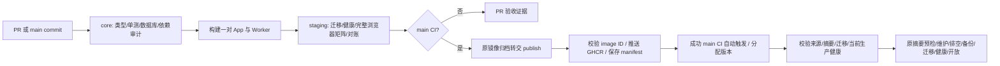

# 发布流水线

关联 #105。当前变更建立“一次构建、同一镜像验收、按摘要晋级”的发布契约。按所有者 2026-10-04 要求，日常合并和部署全自动，无需维护者审核；CI 通过不表示已上线，仍须实际部署及观察证据。详见 [自动发版](AUTOMATIC-RELEASE.md)。

## 候选与生产链路

1. PR 仅触发一次 CI，旧 PR run 自动取消。main 合并后校验实际合并 SHA，不能用 PR 临时 merge SHA 的证据替代。
2. core 执行 lint、普通测试、数据库集成测试、数据对账、生产依赖审计、Compose 配置及发布脚本故障测试。
3. staging 构建一次 App、一次 Worker。Next 生产构建包含在 App Docker builder 中，不再为独立 host E2E 和 staging 重复编译。
4. 使用隔离数据库、随机密钥及测试管理员启动最终镜像，执行 migration、App/Worker 同 SHA 健康、20 并发健康检查、完整 Playwright Chromium/WebKit 矩阵和数据对账。保留桌面 1440×900、手机 390×844 及原有其他尺寸覆盖。
5. PR 不导出发布镜像，也没有 registry 写入权限。main 将验收后原镜像压缩归档交给独立 publish job；这是 Actions runner 之间的传输，不是向生产主机发送完整镜像。
6. publish 校验原 image ID、OCI revision 和验收记录后推送 GHCR，不执行 Docker build。App/Worker 每个标签包含 SHA、run ID 和 attempt；部署只用 digest。
7. 成功的 main CI 产生 `release-candidate-<runId>-<attempt>` artifact。manifest 记录 commit、构建时间、App/Worker registry digest 与 image config ID、CI 来源、验收项、schema 和每个 migration 文件 SHA-256。
8. Deploy Production 从成功 main CI 自动取得精确 SHA、run ID 和 attempt，自动分配或复用版本 tag。任何生产配置注入、拉取或切换前，先验证候选来源及文件内容；等待部署锁后再次跳过已过时 main 候选。workflow_dispatch 保留给恢复与归档重发，没有人工审核确认项。
9. 生产按 manifest digest 拉取，先校验两个 OCI revision 和两个 image ID，全部一致才进入迁移和切换，最终健康通过后才更新兼容的本地 production 标签。登录最多 30 秒，每个 pull 最多 300 秒。禁止用“同 SHA 重新构建”的镜像替换已验收镜像。
10. 候选预检后先验证 HTTPS 维护入口，排空旧 Web/Worker 并确认数据库客户端已退出，随后备份、migration、同版本启动与 HTTPS 健康检查，最后恢复入口。最终健康通过才保存 current manifest；前一 current 单独保留作为恢复参考，不豁免数据库兼容性评估。

## 来源与失败门禁

候选 run 必须来自当前仓库的 `.github/workflows/ci.yml`，事件为 main push 或显式 main workflow_dispatch，head SHA 与发布 SHA 完全一致，整体 completed/success。拒绝 fork、PR、其他 workflow、失败/取消/运行中 run、不同 attempt 的 manifest，以及未合并 SHA。

run 元数据通过 GitHub API 单独读取，与下载的 artifact 分目录存放。镜像路径必须是当前仓库的 `ghcr.io/<owner>/<repository>-app|worker`，摘要与 config ID 必须是完整 SHA-256。schema/migration 清单与单独检出的 release source 逐个比较，不能只信任清单中的声明。

缺少任何产物或验证失败立即终止，不降级为 tag 拉取，不静默重建，不跳过 staging。生产 workflow 只有 registry 读取权限；contents 写权限仅用于自动 tag 和 Release 记录。production Environment 限制精确 main，无人工审查暂停点。

## 缓存与运行时

- App 和 Worker 使用独立 GHA cache scope：release-app、release-worker，防止互相覆盖。缓存导出最多 3 分钟；缓存服务故障不掩盖实际构建失败，也不使已成功构建变成业务发布失败。
- 测试、文档和 workflow 不进入 Docker context；它们仍由 core 检查，单独修改这些文件不会让 App 的 COPY 层和 Next 编译缓存失效。
- APP_COMMIT_SHA/APP_BUILD_TIME 在最终运行镜像末尾注入，metadata 变化不使依赖安装、Next 编译和 Worker 文件层失效；健康接口仍返回精确版本。
- App 以 node 用户运行，明确授予 .next/cache 写权限，其他代码目录保持只读权限语义。CI 用同一非 root 用户验证图片缓存写入。
- HTTP staging 显式 SESSION_COOKIE_SECURE=false；Compose 默认 true，production-preflight 拒绝 false，生产 HTTPS 继续使用 Secure Cookie。
- 测试夹具在清理时恢复周挑战和生日开关的原始记录，避免 fixture 残留改变验收后的运行状态。随机 staging 密钥通过 Actions masking 隐藏，失败健康检查保留状态和 issues 诊断。
- 完整浏览器测试已并入 staging job，旧独立 e2e job 移除。仓库如配置必需状态检查，应使用 core、staging；main 的发布候选还须 publish 成功。不能把 skipped publish（PR 正常跳过）当作可部署产物。

## 留存、回滚与首次切换

Actions 原镜像归档留存 2 天，仅用于传递同一镜像；验收截图/容器日志 14 天；release manifest 与部署候选记录 90 天。生产成功发布后将清单长期保存在 `releases/<SHA>/deploy-<run>-<attempt>.json`，同时保留 previous 清单及 releases/current.json；目录不进入 Git 或 Docker context。GHCR 已发布 digest 不能被清理策略删除，否则回滚将明确失败。

回滚必须先确认数据库与旧应用兼容，再选择旧 SHA 和原成功 CI run ID。应用使用旧 manifest 的原摘要，仍先备份、校验镜像、执行兼容的 migration 检查和健康检查；不自动回退数据库。不可逆 migration 使用前向修复。

默认从原 CI artifact 取清单；超过 90 天或删除后，可显式选择已部署候选的 server-archive 签名留存。仍需验证精确 main CI 身份、原成功 CI attempt、源码和 migration；原 CI 历史被删除、缺签名或旧版不兼容时拒绝恢复。详见 [签名留存与恢复](SIGNED-RELEASE-ARCHIVE.md)。主机互斥与阶段记录见下文，不能据此宣称任意历史版本都可一键回滚。首次采用新链路前应演练候选失败、同版本启动和旧兼容候选回滚；过去未生成 manifest 的发布不伪装成新链路已验收候选。

完整主机发布已改为一次 SSH、同一把主机锁、分阶段 journal、私有配置预检与原子替换、维护入口与任务排空、显式迁移和有界执行。参见 [生产主机发布控制器](SERIALIZED-PRODUCTION-RELEASE.md)。候选预检容器不复用于正式进程，首次旧 Nginx 切换可能重建，不能承诺零停机；旧无签名原镜像基线仍待验证。Worker 依赖精简已在整合 CI 验证，见 [Worker 运行依赖](WORKER-RUNTIME-DEPENDENCIES.md)。各项生产门禁以 [当前上线准备](../PRODUCTION-READINESS.md) 为准。

## 验收与时间目标

发布门禁测试覆盖错误 run/SHA/attempt、失败 CI、篡改 digest/仓库/migration、旧镜像 ID 被替换、无 staging 证据、PR 发布和两镜像校验失败不修改 production 标签。脚本必须通过 actionlint、ShellCheck、Node manifest 测试及 shell 故障测试；实际镜像和全部 UI 在 GitHub staging 验证。

历史串行链路包含 core 构建、host E2E 构建、staging 再构建和生产再构建。本实现消除后面三类重复构建；main 增加原镜像归档传递成本。耗时收益以同仓库 CI run 实测为准，不把目标值写成已实现值。生产切换时长与总 workflow 时长分别记录。

## 周挑战开关与依据

周挑战启停继续使用 Weekly Challenge Production Switch workflow；首次启用仍需独立 DeepSeek shadow 验收和管理员 API 审计，不因发布提速而省略。生产 SSH 继续使用专用部署账号和短时 GHCR token，不提交环境文件或服务器密钥。

- [Docker：独立 GHA cache scope](https://docs.docker.com/build/cache/backends/gha/)
- [GitHub：Workflow run 元数据与状态](https://docs.github.com/en/rest/actions/workflow-runs)
- [GitHub：跨 workflow 下载指定 artifact](https://github.com/actions/download-artifact)
